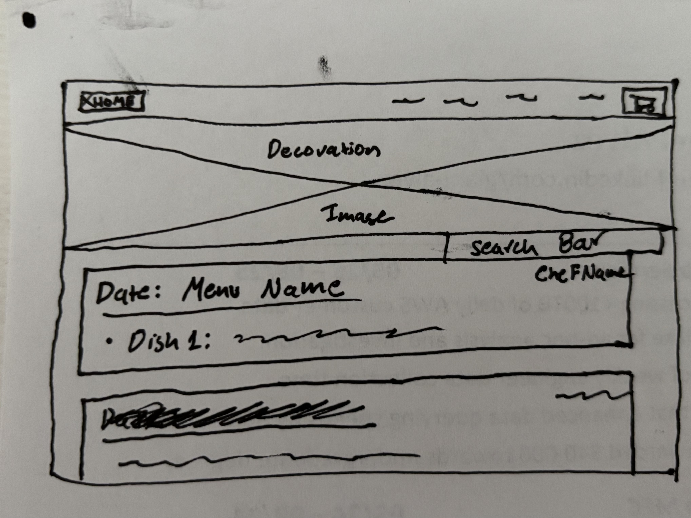
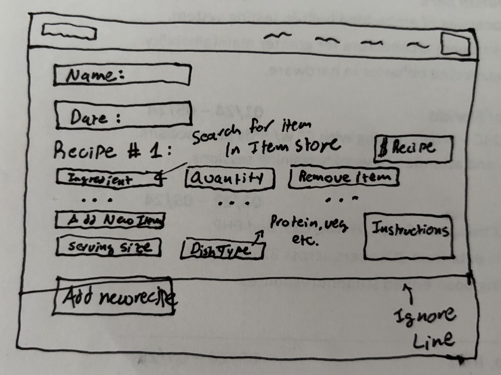

# Assignment 2

## 1. Problem Statement

 1. **Problem Domain** - *La Maison Français*:
    1. Located on the West half of New House 4th floor, around 35 students live together with a shared love for France. This is where I've called home for all of my undergrad and where my deepest friendships have been created over the semesters. In my heart considered as my home away from home.

 2. **The Problem** - *Food Ordering System*:
    1. Within our cooking community we have a cooking system that allows us to feed the entire house dinner six days a week. For each of the six cooking days we have what are called **cook teams** that have a dedicated 5-6 people that cook on that day. Within each cook team every week there is a different **head chef** that leads the cooking for the day, including creating the menu with five different recipes (protein, veg protein, starch, veg, dessert).
    2. This means that every week we have six brand new menus that we must aggregate ingredients for, scale menus appropriately for number of house members, figure out weekly cost to remain under weekly budget, and then finally purchase the ingredients.
    3. For this process we currently have two dedicated house members to accomplish this process, but unfortunately they spend any where from 5-7 hours a week processing all of the menus. This is because there is no formulized system in place, and they have to read/copy/paste through 6 different pdf/word/google docs.

 3. **Stakeholder List**:
    1. Cook Team Members: These house members are those who are a part of cook teams and those who create the menus.
    2. Food Stewards: Critical house members that aggregate weekly menus, figure out purchasing, and buy all the food. They would be the most impacted with the project, as depending on project success it could automate 5 hours of their weekly house tasks.

 4. **Evidence**:
    1. [Annual Food Waste](https://www.usda.gov/about-food/food-safety/food-loss-and-waste/food-waste-faqs): It is estimated that 30% of the food used in the USA is gone to waste due to lack of proper managment.
    2. [Saving Money by Reducing Food Waste](https://www.epa.gov/recycle/preventing-wasted-food-home): By reducing the amount of food we waste through improved food management our house could use that money instead for buying new cookware or other important household needs.
    3. [Opportunity Cost for Time Outweighs Food Management Benefits](https://www.sciencedirect.com/science/article/abs/pii/S0921800923002756): A study revealed that in developed countries the opportunity cost associated with time spent managing food didn't outweigh the benefits of wasting food. Essentially, our time could be spent doing better things than managing food (like doing a UROP instead of keeping track of carrots).
    4. **Observation**: Unfortunately, the amount of times I've seen Food Stewards absolutely dreading their task, working several times more than other members, and then getting blamed for whenever a menu has a missing ingredient is uncountable.
    5. **Food Steward Conversation**: "Having to purchase ingredients is the worst part of my week", "... and you just have to sit there for 5 hours and grind it out", "We've tried other methods with Excel or Google Sheets and its still so time consuming" - Tony Jimenez '27.
    6. [Comparable - SuperCook](https://www.supercook.com/#/desktop): Very easy to use software that provides a variety of recipes for current ingredients in fridge, but manual recipe adding has been reported to be very difficult from users.
    7. [Comparable - KitchenPal](https://www.supercook.com/#/desktop): A mobile solution that has both recipe suggestions and pantry trackers, but doesn't fulfill the weekly management planning that is necessary with our menus.
    8. [Comparable - SamsungFood](https://samsungfood.com/): Provides great recurring meal plan options, but not as helpful with daily changing menus with drastic different ingredients.

## 2. Application Pitch

 1. **Name**: Menu Maître ("*maître*" = master in French)

 2. **Motivation**: *One sentence problem summary*
    1. Streamline La Maison Français’ weekly food system by automating menu collection, scaling, budgeting, and shopping in order to save Food Stewards 5+ hours of tedious work every week while reducing stress, waste, and costs.

 3. **Key Features**:
    1. **Smart Menu Collection**:
       1. *What?*: Simple interface that allows Cook Team members to input their menu data with all of their dishes, including serving quantity, food type (protein, starch, etc.), ingredients, and description. Aggregates ingredient data from all menus for the week into one interface that allows categorization by shopping location and menu date.
       2. *Why?*: Mitigates the problem by centralizing all menu data into one place, which allows for easier scalability, tracking, cost estimation, and management. Food Stewards won't have to centralize the data themselves.
       3. *Stakeholder Impact?*:
          1. Cook Team Members: Instead of writing menus into Microsoft Word, they would have to create their menus within the application.
          2. Food Stewards: No longer need to go through 6 different menus every week, this feature would automatically gather all the ingredients across menus for the week.
    1. **Cost Estimator**:
       1. *What?*: Estimates cost for any grouping of ingredients by using the direct prices of ingredients stored within the applciation.
          1. Menus: During menu creation would provide an estimate of the menu cost.
          2. Collection: For weekly aggregation of menus able to estimate how much the whole week will cost.
       2. *Why?*:
          1. First, a historical problem has been with over-budget menus. This leads to Food Stewards having to cut certain ingredients and then Cook Team members getting upset they didn't get what they wanted. With this feature during menu creation Cook Team members would see that their menu is estimated to be 2-3x over budget and let them know sooner. Ultimately creating a shorter feedback loop and appropriately setting expectations.
          2. Second, enhanced ease of scaling menus. The calculation for cost would automatically be done with this feature, allowing scaling of menus/dishes to be easier to fit budget constraints.
       3. *Stakeholder Impact?*:
          1. Cook Team Members: Lets them know if their menu is overbudget. Allows them to change things if necessary. Sets appropriate expectations of the food they will be receiving.
          2. Food Stewards: No longer scapegoat when they must remove items. Don't have to spend more time scaling and calculating costs for menus, saving additional time.
    1. **Instant Cart**:
       1. *What?*: Once Food Stewards have confirmed all the menu ingredients for the week and appropriately scaled ingredients, this feature would automatically create a list of stores and the necessary ingredients to buy from them.
       2. *Why?*: This feature would mitigate the problem as Food Stewards don't need to figure out where to buy the ingredients. A simple list would be provided and they can simply add everything to their cart.
       3. *Stakeholder Impact?*:
          1. Cook Team Members: No impact.
          2. Food Stewards: No longer need to organize ingredients by store.

## 3. Concept Design

### 3.1 Concept Specification

#### 3.1.1 UserAuthentication

**concept** UserAuthentication\
**purpose** limit User access to particular subset of resources\
**principle** a person is *registered* as a User with a username and password by the Administrator, afterwards that person can *authenticate* as their registered user and view the resources the Administrator granted to them\
**state**  
    an Administrator with\
        a username String\
        a password String\
    a set of Users with\
        a username String\
        a password String

**actions**\
    register (username: String, password: String):\
            **requires** no User exists with username\
            **effects** creates new User w/ username and password\
    authenticate (username: String, password: String): (user: User)\
            **requires** User exists with that username and password\
            **effects** authenticated as returned User and can view other concepts data that User has\
    administratorAuthenticate (username: String, password: String): (admin: Administrator)\
            **requires** Administrator has that username and password\
            **effects** authenticated as returned admin and can view all concept data that admins have access to

#### 3.1.2 ItemStore

**concept** ItemStore [User, Administrator]\
**purpose** store data regarding items necessary for purchase\
**principle** A user would like to purchase a new item that hasn't been purchased before. They can *enter* that new item into the system with sample data they find online. Later, the Administrator can *confirm* that new item and its data before being purchased. If the data of that item ever changes (cost, store no longer has it) the Administrator is able to *update* its data.\
**state**  
    a set of Item with\
        a name String\
        a price Float\
        a quantity Float // Ex. 3\
        a units String // Ex. "lbs"\
        a store String\
        a confirmed Bool

**actions**\
    enter (name: String, price: Float, quantity: Float, units: String, store: String): (item: Item)\
            **requires** no Item already exists with name\
            **effects** returns and stores new Item with all passed in data\
    confirm (name: String, price: Float, quantity: Float, units: String, store: String): (item: Item)\
            **requires** Item exists with name and hasn't been confirmed yet, called by Administrator\
            **effects** returned item is now confirmed\
    update (name: String, price: Float)\
    update (name: String, quanitity: Float)\
    update (name: String, units: String)\
    update (name: String, store: String)\
            **requires** Item exists with name, called by Administrator\
            **effects** update the given attribute\

Note: The quantity and units is the size of the item the store sells it by. The purpose of having users enter items is so that they are able to see an estimate of the cost, and then once the admin go in they can confirm and finalize everything associated with that item.

#### 3.1.3 PlatMaison

**concept** PlatMaison [Item, User]\
**purpose** grouping of necessary items to make a particular dish \
**principle** A user would like to make a certain dish and needs the ingredients to make it. In order to purchase said ingredients they *create* a dish and then *updateIngredient* to add/update/remove ingredients as needed. They are able to *update* the attibutes to their recipe as needed afterwards as well. \
**state**  
    a set of Recipe with\
        a set of Item with\
              an amount Int\
        a name String\
        an instructions String\
        a dishPrice Float\
        a servingQuantity Int\
        a dishType String\
        an owner User

**actions**\
    create (name: String, instructions: String, servingQuantity: Int, dishType: String): (recipe: Recipe)\
            **effects** returns new empty recipe with name, instrucitons, and servingQuantity attributes that is owned by calling user\
    updateIngredient (recipe: Recipe, item: Item, amount: Int)\
            **requires** recipe exists, calling user owns recipe\
            **effects** recipe updated to contain item with set amoung, price of recipe updates appropriately\
    update (recipe: Recipe, instructions: String)\
    update (recipe: Recipe, servingQuantity: Int)\
    update (recipe: Recipe, dishType: Int)\
    update (recipe: Recipe, name: String)\
            **requires** recipe exists, calling user owns recipe\
            **effects** update the given attribute

#### 3.1.4 MenuDuJour

**concept** MenuDuJour [Recipe, User]\
**purpose** organization of recipes necessary for a meal \
**principle** A user needs to plan a several course meal with a variety of dishes to eat. They can *createMenu* and then *addRecipe* with the necessary scaling factors to feed the amount of people they need to serve. If they so desire they can also *update* their menu's information.\
**state**  
    a set of Menu with\
        a set of Recipe with\
              an scalingFactor Int\
        a name String\
        an owner User\
        a menuCost Float\
        a date String\

**actions**\
    createMenu (name: String, date: String): (menu: Menu)\
            **effects** returns new empty menu that is owned by calling user, and has name/date attributes\
    addRecipe (menu: Menu, recipe: Recipe, scalingFactor: Int)\
            **requires** menu exists, recipe exists, calling user owns menu \
            **effects** adds recipe and scaling to menu, updates menuCost appropriately\
    updateRecipeScaling (menu: Menu, recipe: Recipe, scalingFactor: Int)\
            **requires** menu exists, recipe exists, calling user owns menu\
            **effects** adjusts recipe scaling to menu (removing from menu if zero), updates menuCost appropriately\
    update (menu: Menu, name: String)\
    update (menu: Menu, date: String)\
            **requires** menu exists, calling user owns menu\
            **effects** update the given attribute\

#### 3.1.5 ShoppingCart

**concept** WeeklyShoppingCart [Menu, Recipe, Item, Administrator, User]\
**purpose** organization of menus for the week to buy all necessary ingredients \
**principle** An administrator must buy the ingredients for all of the menus for that week. As *addMenu* is passing in menus, all of their ingredients will be added to the cart for the week of that menu. Administrators can then see aggregation of ingredients and cost and determine whether they need to modify scaling of Menus or Recipes using *adjustRecipeScale* or *adjustItemScale*.\
**state**  
    a set of Cart with\
        a set of Menu\
        a cartCost Float\
        a startDate String\
        a endDate String\

**actions**\
    createCart (name: String, date: String): (cart: Cart)\
            **effects** returns new empty cart with the date range Sun-Sat of the date that was passed in\
    addMenu (cart: Cart, menu: Menu)\
            **requires** cart exists, menu exists, menu date falls within cart dateRange\
            **effects** menu along with all of its ingredients are added to the cart\
    deleteMenu (cart: Cart, menu: Menu)\
            **requires** cart exists, menu exists, menu is in cart\
            **effects** menu along with all of its ingredients are removed from the cart\
    adjustRecipeScale (cart: Cart, menu: Menu, recipe: recipe, scalingFactor: Int)\
            **requires** cart, menu, and recipe all exist, recipe in menu, menu in cart\
            **effects** within the cart adjusts to have the new scaling factor of specified recipe in menu, adjust cart price appropriately \
    adjustItemQuantity (cart: Cart, menu: Menu, item: Item, quantity: Int)\
            **requires** cart, menu, and item all exist, item in some recipe in menu, menu in cart\
            **effects** within the cart adjusts number of item purchased to quantity, adjust cart price appropriately \

Note: Administrators adjusting scaling will not directly alter menu or recipes, but rather just the cart.

### 3.2 Synchronizations

      **sync** userMenuDuJourAccessControlSync\
      **when**\
           UserAuthentication.authenticate(username, password: String): (user)\
           MenuDuJour.createMenu(): (menu)\
           Request.(addRecipe, updateRecipeScaling, or updateRecipe)(menu, other parameters depends on action)\
      **then** MenuDuJour.(addRecipe, updateRecipeScaling, update)(menu, parameters depends on action)\
      Note: This is a representative sync, can be extended to all access control for all actions done by users

      **sync** adminAccessControlSync\
      **when**\
           UserAuthentication.administratorAuthentication(username, password: String): (admin)\
           Request.confirmNewitem(item)\
      **where** ItemStore.enter(): (item) // done by any user\
      **then** ItemStore.confirm(menu, parameters depends on action)\
      Note: This is a representative sync, can be extended to all access control for all actions done by administrators

      **sync** menuToCart\
      **when** MenuDuJour.createMenu(date:String): (menu)\
      **where** cart doesn't exist for date range\
      **then**\
            ShoppingCart.createCart(date): (cart)\
            ShoppingCart.addMenu(cart, menu)

      **sync** menuToCart\
      **when** MenuDuJour.createMenu(date:String): (menu)\
      **where** cart exist for date range\
      **then** ShoppingCart.addMenu(cart, menu)

### 3.3 Brief Note

The application is designed to automate and streamline the full pipeline of food planning, from creating dishes to generating a weekly shopping list. Each concept represents a layer of this workflow.

**UserAuthentication** provides the foundation for access control. Users and Administrators authenticate to gain access to other concepts: Users create recipes and menus, while Administrators confirm item data and adjust weekly shopping carts. Generic type parameters in downstream concepts are always bound to these roles (e.g., User in PlatMaison or MenuDuJour always refers to authenticated house members; Administrator in ItemStore and WeeklyShoppingCart always refers to authenticated stewards).

**ItemStore** is the authoritative source of truth for purchasable ingredients. Users may propose new items, but only Administrators can confirm or update them. This ensures data integrity and accurate pricing. Items from this store flow into recipes, menus, and shopping carts.

**PlatMaison** defines the dish level concept: a recipe built from confirmed items, owned and editable by its creator. It transforms raw items into structured dishes with prices, servings, and instructions.

**MenuDuJour** groups dishes into a full daily menu. Users can add their recipes into menus, apply scaling factors for the number of servings, and update menu information. The cost of a menu is automatically derived from its recipes.

**WeeklyShoppingCart** aggregates menus across a week into a single cart. It provides administrators with an overview of total ingredients and costs. Adjustments here (scaling recipes, tweaking item quantities) affect only the cart view, not the underlying menus or recipes, allowing flexibility without data corruption.

Together, these concepts create a hierarchy: **Items → Dishes → Menus → Weekly Cart**.

## 4. UI Sketches

### 4.1 Home Page

- Top image for decoration
- All menus on home page are listed in order by date
- Search applies filter to sort menus

### 4.2 Item Store

- Contains list of all items currently in database
- When clicking add item a popup occurs for user to add data

### 4.3 Menu Page

- Essentially a form page where you add all necessary menu information
- Add/remove recipes as needed (add recipe bottom left sorry bad hand writing)

### 4.4 Shopping Cart

- Top portion is for currently selected menu of the week
- Bottom portion contains aggregation for all menus of the week

## 5. User Journey

As the two stakeholders will be interacting differently with the application, I will write two different user journeys.

### 5.1 Cook Team Member

It’s Tuesday afternoon, and Emma, the head chef for tonight’s cook team, sits down to plan the dinner menu for La Maison Français. Normally she would open a blank Word doc and start writing her five required dishes, but remembers that the house has a new system called *Menu Maître* to help the Food Stewards with the food management process.

Instead, Emma logs into Menu Maître and opens the *Home Page* (see sketch 4.1). Scrolling through the page she is able to see other menus that members have already seen before (gaining inspiration for her own). She clickes the "NEW MENU" button in the top bar and is redirected to a blank *Menu Page* (sketch 4.2) and starts adding recipes directly. For each dish, she selects ingredients using the search button that selects directly for items stored within the *Item Store*, which already has prices, units, and stores listed. All she does is add the quantity that she would like. As she adds recipes, the app automatically calculates serving sizes and shows her the estimated menu cost. When her dessert pushes the budget too high, she swaps it for a cheaper option and sees the estimate drop back within range.

By the time Emma finishes inputting data into the form, she takes roughly as long as it would have with a Word document. Only this time she is happier knowing she saved her friend Food Steward tony from having to aggregate her menu.

### 5.2 Food Steward

On Sunday morning, Tony, one of the Food Stewards, usually dreads the long grind of menu aggregation but is abnormally happy this week with the addition of the new food management system. Tony logs into *Menu Maître* and opens the *Shopping Cart* (sketch 4.4). The menus for the week are already in the system, because each cook team entered their menus directly into the app. The cart view shows him the combined ingredients across all six menus, organized by store.

Tony notices that the cost for Wednesday's menu is severely over budget. Instead of recalculating by hand, he uses the adjust scaling feature by clicking the *W* within the week bar (sketch 4.4), and can see that they multiplied to scale for 100 instead of 30 for their protein dish. Tony simply updates the scale right next to the dish (sketch 4.4) and the total cost instantly updates. With a single click, the updates the shopping list as well factoring in the change of ingredients.

After glancing through each menu, Tony notices that Thursday added a new item "Jellyfish" for their menu. To confirm the new item Tony uses the top menu bar to go to the *Item Store* page (sketch 4.2) and searches for the new item. He updates the price, store, and everything necessary from information online and confirms it to the system. He goes back to the Shopping cart can now use the lists provided (sketch 4.4) have been updated with the confirmed Jelly Fish prices. Tony can now simply order all the ingredients from the lists provided.
